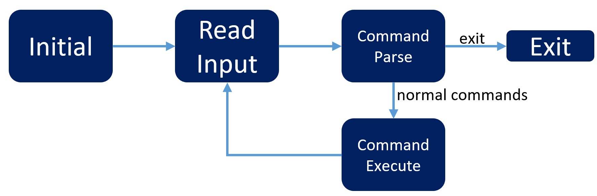

# Homeworks of Datastructure, NTUST-ECE, 109
[Github repo](https://github.com/qqq89513/Datastructure-Homework) (You can also check for the commit messages.)  
[Online version of this report](https://hackmd.io/moTv5caNRXWb0vGRcFnvQA?view) (HackMD)  

## Doubly linked list with complex number
  - Features  
  From the PDF: Consider a complex number system(ie. *x+iy*). For complex number data sets, create a user-friendly, menu-driven program that implements a doubly **linked list**, including the following operations. Please discuss the complexity for each operation.  
    - (a) Build a list by reading a sequence of complex numbers from input.  
    - (b) Determine if a list is empty.  
    - (c) Search for a complex number.  
    - (d) Search for a complex number.  
    - (e) Delete a complex number.  
    - (f) Print out a list.  
    - (g) Count the number of times a given complex number occurs in a list.  
    - (h) Find the middle element of a list.(If there are even nodes, then there would be two middle numbers.)  

### Usage
Compile and execute the code, and then it shows you how to perform above features with specific commands.
```
$ .\HW01_doubly_list_complex_num.exe
Welcome message blablabla
   Usage:[OPTION] [COMPLEX]... 
  
  [COMPLEX]
  Single complex.
  
  [COMPLEX]...
  One or more than one complex number with the format "a+bi", "a" or "bi". 
  a is the real part and b is the imaginary part.
  Multiple complex numbers should be spilted with space. Here is an example:
    10+i i -3.2i -3.5+9.7i 87
  
  [OPTION]
  help                  Show this help. 
  build [COMPLEX]...    Build a doubly linked list storing comlex numbers, which are [COMPLEX]...        
                        Build an empty list if [COMPLEX]... is not supplied.
  isempty               Print "The list is empty." or "The list is not empty.". 
  insert [COMPLEX]...   Insert one or multiple complex numbers into the end of the doubly list. 
  search [COMPLEX]      Search for a complex number. Return the mathed complex numbers with their indexs 
                        and the total matched count 
  rm [COMPLEX]          Delete a complex number in the doubly linked list.
  print                 Print the whole list with indexing starting from zero.
                        Each complex number is printed with its index and newline.
  count [COMPLEX]       Work like "search [COMPLEX]".
  middle [COMPLEX]      Find the middle element of a list.
                        (If there are even nodes, then there would be two middle numbers.)
>> 
```
Example:
```
>> build 1+2i 3+4i 5.6
>> insert 7.89+10i 11.12+13.14i
>> print
Node 0: 1+2i
Node 1: 3+4i
Node 2: 5.6+0i
Node 3: 7.89+10i
Node 4: 11.12+13.14i
```
### Discussion  
  - Flow  
  Briefly explanation of executing procedures of this code.
    > Blcok diagram  
    > 
    - **Initail**: The entry of the program, including declartions and initializing of local varibles. Then print the welcome and help messages.
    - **Read Input**: Wait for and capture user input from `stdin` with `fgets()`.
    - **Command Parse**: Spilt the command into `[OPTION]` and `[COMPLEX]...`
    - **Exit**: If `[OPTION]` is `exit`, then free the dynamic allocated memories and exit.
    - **Command Execute**: If `[OPTION]` is not `exit`, execute a corresponding feature *((a)~(h) from above)* .

  - Time Complexity of custom functions  
    These are the functoins invoked by implementation of the features. So I will talk about the timecomplexity of these functions before we get to the time complexity of features. Here is the table of symbols and representations that will show up in the following discussion.  
    |Symbol|Represntation|
    |-     |-            |
    | O( ) | big-oh|
    | N    | Node counts in existing list |
    | n    | Input complex number counts. (counts of `[COMPLEX]...`)|
    | len  | Character counts of each `[COMPLEX]`|
      - `function_name`: big oh
      - `compare_complex`: O(1)  
        No loop statement envoled.
        ```c=248
        /** Compare two complex number, return 0 if a==b
         *  @param a A complex number struct pointer
         *  @param b A complex number struct pointer
         *  @return Absolute difference between a and b.
         *          which is 0 if complex number a equals to complex number b
         * */
        unsigned int compare_complex(dlistComplex *a, dlistComplex *b){
          int real_diff = a->real - b->real;
          int  img_diff = a->img  - b->img;
          
          // limit the difference at positive or zero
          real_diff = real_diff>=0 ? real_diff : -1*real_diff;
          img_diff  =  img_diff>=0 ?  img_diff : -1*img_diff;

          return real_diff+img_diff;
        }
        ```
      - `str2complex`: O(len)  
        `len` is the character counts of a string of a complex number from user input. For example, for `3.4+i`, `len` is 5. There are several `for` loops with execution times of `len`, which leads to O(`len`).
        ```c=306
        /* Convert string to complex
          @return 0 on success, -1 on string format error*/
        int str2complex(const char *str, float *real, float *img);
        ```
        ```c=322
          // Check for character if it's not one of '0'~'9', 'i', '+', '-' nor '.'
          for(i=0; i<len; i++){
            if(!('0'<=str[i] && str[i]<='9') && str[i]!='i' &&  str[i]!='+' &&  str[i]!='-' &&  str[i]!='.'){
              if(DEBUG)   printf("@line%d Wrong format, character is not 0~9 nor \'i\'.\n", __LINE__);
              return -1;
            }
          }
        ```
      - `insert_complex`: O(1)  
        No loop statement envoled.
        ```c
        /* Create a node, insert it to after trail and return the new trail pointer.
           */
        dlistComplex *insert_complex(dlistComplex *trail, float real, float img){
          dlistComplex *temp = malloc(sizeof(dlistComplex));
          temp->real = real;
          temp->img  = img;
          if(!trail){
            trail = temp;
            trail->L = trail;
            trail->R = trail;
          }

          // original: (trail)<=>(trail->R)
          // inserted: (trail)<=>(temp)<=>(trail->R)
          else{
            // two links(in/out) at right side of temp
            temp->R       = trail->R;
            (trail->R)->L = temp;
            
            // two links(in/out) at left side of temp
            temp->L       = trail;
            trail->R      = temp;
          }

          return temp;
        }
        ```
      - `insert_str_arr`: O(n\*len)  
        The for loop executes `counts` times, which is n, the input complex number counts. And each loop executes `insert_complex` and `str2complex` once, results in n\*(1+len) = O(n*len).
        ```c =265
        /* Insert the string array as nodes to trail and return the new trail */
        dlistComplex *insert_str_arr(dlistComplex *trail, char **arr_str, int counts){
          float real=0, img=0;
          for(int i = 0; i<counts; i++){
            real = 0;
            img = 0;
            if(str2complex(arr_str[i], &real, &img)!=0)
              printf("@line%d Wrong format of complex number at index of %d:%s. 0+0i inserted.\n", __LINE__, i, arr_str[i]);
            trail = insert_complex(trail, real, img);
            if(DEBUG)   printf("Complex %d: %2.2f, %2.2fi\n", i, trail->real, trail->img);
          }
          return trail;
        }
        ```

  - Time Complexity of features  
      - (a) **Build**  O(n)  
          Line 104 takes O(1) and line 109 takes O(n), results in O(n), where n is the input complex number counts.
          ```c =102
          // Create a list if it's empty
          if(!head){
            head = insert_complex(head, 0, 0);  // real=img=0 cuz head contains nothing.
            current = head;
            // Insert the complex numbers if there is any
            // arr_str[0] is command, complex numbers start from arr_str[1]
            // counts-1 cuz the steps from arr_str[1] to end is counts-1
            current = insert_str_arr(current, arr_str+1, counts-1);
          }
          else printf("The list already created.\n");
          ```
      - (b) **Is Empty** O(1)  
          No loop statement envoled.
          ```c =114
          if(!head)
            printf("The list is empty.\n");
          else
            printf("The list is not empty.\n");
          ```
      - (c\) **Insert** O(1)  
          Line 121 take O(n\*len). However, according to the feature requirement:  
          > (c\) Insert a complex number.   
          
          So the input complex number counts n=1, we have O(len). From the point of view of *inserting a complex number*, the steps of processing input string is neglectable. So the time complexity is O(1).  
          ```c =118
          if(!head)
            printf("The list is empty. Type \"build\" to build a list.\n");
          else
            current = insert_str_arr(current, arr_str+1, counts-1);
          ```
      - (d) **Search** O(N)  
          The for loop at line 140 executes N times to traverse the existing list, where N is the node counts in existing list. And line 141 in the for loop takes O(1), 1\*N results in O(N).
          ```c =122
          if(!head)
            printf("The list is empty. Type \"build\" to build a list.\n");
          else if(counts<2){
            printf("Please give one complex number to search.\n");
            printf("Example: \"search 3+7.8i\" or count 10-4.5i\n");
          }
          else {
            dlistComplex *node = head->R;
            dlistComplex target;
            int i=0, found=0;
            float real, img;

            // Convert input string to complex
            str2complex(arr_str[1], &real, &img);
            target.real = real;
            target.img = img;

            // Iterates the list to find target
            for(node=node; node!=head; node=node->R){
              if(!compare_complex(node, &target)){
                printf("Node %d: %g%+gi\n", i, node->real, node->img);
                found++;
              }
              i++;
            }
            printf("Search total hits %d times.\n", found);
          }
          ```
      - (e) **Delete** O(N)  
          Line 165 takes O(1) and the for loop at line 170 traveses the existing linked list to find the match complex number to remove, which takes N relative steps. O(1+N) results in O(N). Simply removing a node in a list should just take O(1). But this feature **(e) Delete** involves searching for a specific complex number, it turns out time complexity of O(N).  
          ```c =151
          if(!head)
            printf("The list is empty. Type \"build\" to build a list.\n");
          else if(counts<2){
            printf("Please give one complex number to delete.\n");
            printf("Example: delete 3+7.8i\n");
          }
          else {
            dlistComplex *node = head->R;
            dlistComplex *temp;
            dlistComplex target;
            int i=0, del_cnt=0;
            float real, img;

            // Convert input string to complex and delete it
            str2complex(arr_str[1], &real, &img);
            target.real = real;
            target.img = img;

            // Iterates the list to find target
            for(node=node; node!=head; node=node->R){
              if(!compare_complex(node, &target)){
                printf("Delete Node %d: %g%+gi\n", i, node->real, node->img);
                (node->L)->R = node->R;
                (node->R)->L = node->L;

                temp = node;
                node = node->L;
                free(temp);
                del_cnt++;
              }
              i++;
            }
            printf("Total %d nodes deleted.\n", del_cnt);
          ```
      - (f) **Print** O(N)  
          Similar to **(d) Search** and **(e) Delete**, the for loop at line 191 traverses the existing list, so the time complexity is O(N).
          ```c =187
          if(!head)   printf("The list is empty.\n");
          else{       // non empty list
            dlistComplex *node = head->R;
            int i=0;
            for(node=node; node!=head; node=node->R){
              printf("Node %d: %g%+gi\n", i, node->real, node->img);
              i++;
            }
          }
          ```
      - (g) **Count** O(N)  
          This feature has similar functions to **(d) Search**, so the entry of these two features are same. Of course the time complexity is same as **(d) Search**.  
          ```c =121
          else if(!strcmp(arr_str[0], CMD_SEARCH) || !strcmp(arr_str[0], CMD_COUNT)){
          ...
          ```
      - (h) **Middle** O(N)  
          In the way of my implementation, there isn't a varible recording the node counts of the existing list with every insertion and deletion. Therefore I have to get the number of nodes before acquiring the middle node. Line 204 counts for nodes in the list which takes relative N steps. Line 210 locates the middle node, starting from the begining of the list, which takes relative N/2 steps. Combining all together, the time complexity is N+N/2=1.5*N ==> O(N)
          ```c =198
          if(!head)   printf("The list is empty. Type \"build\" to build a list.\n");
          else{       // non empty list
            dlistComplex *node = head->R;

            // Count for how many nodes
            int cnt_node = 0;
            for(node=node; node!=head; node=node->R)
              cnt_node++;

            // Find the middle one
            int i;
            node = head->R; // points to the first node
            for(i=0; i<cnt_node/2; i++)
              node = node->R;

            // Print the middle one, print two nodes if the number of nodes are even
            if(cnt_node%2==0)
              printf("Node %d: %g%+gi\n", i-1, (node->L)->real, (node->L)->img);
            printf("Node %d: %g%+gi\n", i, node->real, node->img);
          }
          ```


### Summary
  | Function/Features | Big Oh    | Remarks                                                                             |
|-------------------|-----------|-------------------------------------------------------------------------------------|
| `compare_complex` | O(1)      |                                                                                     |
| `str2complex`     | O(len)    | len for length of string representing a complex number                              |
| `insert_complex`  | O(1)      |                                                                                     |
| `insert_str_arr`  | O(n\*len) | Call `str2complex` and `insert_comlpex` for n times.                                |
| (a) **Build**     | O(n)      | n for element counts of a sequence of complex numbers from input                    |
| (b) **Is Empty**  | O(1)      |                                                                                     |
| (c\) **Insert**   | O(1)      |                                                                                     |
| (d) **Search**    | O(N)      | N for the node counts of the list                                                   |
| (e) **Delete**    | O(N)      | N for the node counts of the list. Traverse(search) the match node and then delete. |
| (f) **Print**     | O(N)      | N for the node counts of the list                                                   |
| (g) **Count**     | O(N)      | N for the node counts of the list                                                   |
| (h) **Middle**    | O(N)      | N for the node counts of the list                                                   |